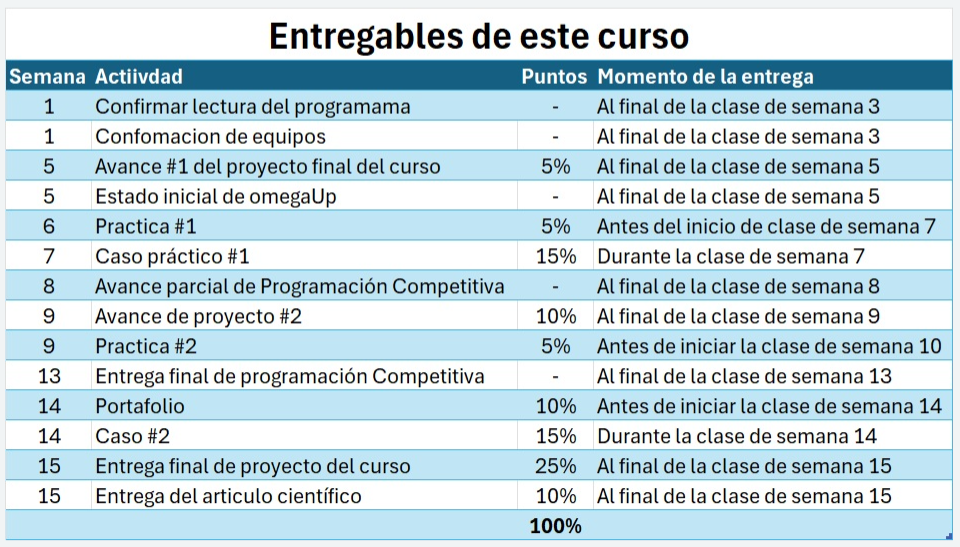

# Week 01 Class Notes — SC-403 Web Application Development and Patterns

> These notes summarize the most relevant points discussed during the first class.  
> They are intended as weekly class notes, not as a full explanation of every concept.

---

## 📌 Course Activities During the Term

- There will be **practice assignments** during the term. Exact dates must be checked in the virtual campus.
- The **portfolio** is developed week by week using GitHub.
- Two repositories will be used:
    - A **private portfolio repository** to show weekly progress.
    - A **private collaborative repository** for the final course project.
- The final project repository will be explained in more detail later.

---

## 🧮 Evaluation Overview

| Activity | Percentage |
|---|---:|
| 2 practice assignments | 10% total |
| Portfolio | 10% |
| Final project | 50% |
| 2 practical cases | 30% |
| **Total** | **100%** |

The professor made a quick overview of the evaluation. Each student must read the detailed instructions and rubrics in the virtual campus.

The course campus includes a table with all deliverables and dates:



---

## 🧾 Final Project Notes

- The final project has a detailed instruction document in the virtual campus.
- This document must be read carefully because it explains the full scope and requirements.
- The professor emphasized that the project should be something that could be **sellable** or useful in a real context.

> [!IMPORTANT]
> The final project instructions must be reviewed in detail.

---

## ⚠️ Zero-Grade Conditions Mentioned

The detailed conditions are explained in the project document, but the professor mentioned some important risks:

- Using a structure or development approach not covered in class.
- Not using the expected view pattern.
- Using a database from another project.
- Using hardcoded data stored locally.
- Storing images locally instead of using cloud storage when required.
- Ignoring the class methodology or required implementation style.

> [!WARNING]
> These conditions must be verified directly in the official final project document.

---

## 👥 Group Task

- Students must choose a group.
- The group selection is managed through the virtual campus.
- Students should also create a WhatsApp group.
- This is a small pending task, but it does not appear to have a direct grade.

---

## 🛒 Weekly Store Project

The professor presented the weekly instructional project: an online store.

The store includes or will include:

- Product filtering.
- Login functionality.
- A top menu with category filters.
- Category-based navigation.
- Language switching between different languages.
- Administrator actions for categories.
- Category creation and update.
- Product management.
- Special product queries, such as filtering by price range.
- User management from the administrator side.
- Security permissions.
- Role assignment for users.
- Render deployment using a free account, which may make the platform slow.

---

## 🗓️ Store Project Progress by Week

| Week | Expected Progress |
|---|---|
| Week 3 | Category listing |
| Week 4 | Buttons to add categories |
| Week 5 | Functional product listing |
| Week 6 | Category information and initial filter |
| Week 7 | Practical case |
| Week 8 | Improved filtered queries |
| Week 9 | User creation management and menu changes depending on user |
| Week 10 | User registration and login |
| Week 11 | Shopping cart |
| Week 12 | Billing / invoicing |

---

## 💻 Topics Covered in Class

- NetBeans project setup was explained.
- I use IntelliJ IDEA, so NetBeans-specific steps are not detailed here.
- Git and GitHub setup was also explained.
- Thymeleaf and Spring Boot configuration were discussed.
- IntelliJ may require different configuration steps than NetBeans.

> [!NOTE]
> Some topics from this course were already covered in previous coursework using PHP, JavaScript, HTML, and related web technologies. I will mention them when relevant, but I will not repeat concepts I already understand unless needed for the repository.

---

## 🌐 HTML Review

- Basic HTML usage was reviewed.
- This topic is already familiar from previous coursework.
- It is still recommended to review HTML as needed.

---

## ⚙️ `application.properties`

In `src/main/resources/application.properties`, project properties can be configured.

The following property was added:

```properties
server.port=80
```

Purpose:

- Changes the default local port from `8080` to `80`.
- After running the project, the application can be opened directly using:

```text
localhost
```

---

## 🧩 Project Properties

Important configuration points:

- Set the compile target release to **21**.
- Use **JDK 21**.
- Enable **Compile on Save** when available.
- Compile on Save helps update the compiled output when a file is saved.

---

## 📁 Week 01 Resources

- Files were downloaded from the Week 01 resources.
- These files were moved into the project.
- The exact file movements should be reviewed in `clase01.mp4` or its transcription.
> [!NOTE]
> This resource is not hosted in this repository. It is a private student resource used only for personal review.

Important detail:

- The `Dockerfile` was moved into the project.

---

## 🔐 GitHub Token

- The professor explained how to connect the repository to the IDE.
- It is important to save the communication token.
- This process is already familiar, so it is not detailed here.

---

## 🚀 Render Account and GitHub Connection

The professor explained how to create a Render account.

General Render + GitHub connection steps:

1. Create or log in to a Render account.
2. Connect the GitHub account to Render.
3. Authorize Render to access the selected repository.
4. Select the repository that contains the Spring Boot project.
5. Configure the service settings according to the project type.
6. Confirm that Render can read the repository and build the project.
7. Deploy the project and review the generated public URL.

> [!NOTE]
> More detailed Render configuration may be needed later depending on the final project requirements.

---

## ✅ Class Summary

The first class focused on:

- Course organization.
- Evaluation structure.
- Portfolio and final project repositories.
- Final project expectations.
- Weekly store project overview.
- Initial Spring Boot project setup.
- GitHub and Render setup.
- Basic project configuration for local execution.
